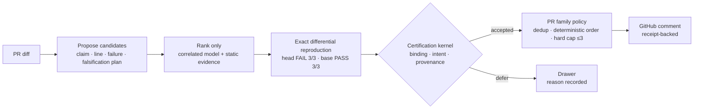

# Franz Xu

> **I build AI-native systems that turn ambitious ideas into reliable, usable products — with strong architecture, explicit trust boundaries, and human control where it matters.**

I am a developer and researcher working on reliable multi-agent decisions,
secure agent infrastructure, and local-first systems. Most AI products optimize
for producing an answer. I care about the step before that: **whose evidence
counts, how much it counts, and whether the evidence is strong enough to act.**

`Python` · `Rust` · AI evaluation · distributed systems · applied cryptography

## Featured project — [Attest](https://github.com/IcantFind-a-username/Attest)

**Evidence-first AI code review where the model investigates and a non-model
adjudicator decides what may be said.**

Attest has moved from a scoring experiment to an end-to-end GitHub Action with
a separate certification boundary. The production path treats model agreement
as correlated ranking information, never as a vote or proof. A generated test
then runs repeatedly on the immutable head and merge base inside a secretless
Linux container. Only the certification kernel can turn that observation into
an author-visible finding.

Every red finding now maps one-to-one to an accepted current-task receipt. The
receipt binds the claim, hunk, exact test bytes and node, commands, interpreter,
environment, fresh run directories, changed-line execution and controller
seal; the resulting bundle can be verified offline. Base-owned policy controls
admission, and a PR-level family policy enforces a hard cap of three findings
across inline comments **and** the summary.

The same construction rule now governs four planned levels of speech:
**red** needs a differential receipt; **gate** needs an executable failure of
new code on a witnessed reachable input; **yellow** may state only premises a
deterministic checker verified; **green** needs a computable structural measure
and at least two concrete coordinates. Red exists on the product path. Green
v0 exists and has been measured offline; gate and yellow are not built yet.

### Where it stands now

- **The safety spine is implemented.** Receipt-only publication, merge-base
  review, base-owned policy, exact-node and changed-line binding, fresh-state
  execution, authenticated bundles, secretless Linux isolation and the public
  hard cap are all on `main`.
- **It has crossed the repository boundary.** The Action has been installed on
  an outside repository, built its container on a GitHub-hosted runner, ran a
  reproduction and posted a real PR comment. That result was a documented
  `DEFER`, not a claimed defect.
- **The prospective shadow has real scale, but no borrowed certainty.** Across
  100 recent change units, the red path produced 21 accepted receipts and seven
  shadow findings on three units. None was published and none is counted as
  correct without independent adjudication.
- **A cheaper structural level is emerging.** Green v0 found repeated
  implementations in 8 of 33 Python-touching units (12 findings) with zero
  model calls. In a five-finding author review, four were clearly true and one
  was overstated. It is not wired into publication yet.
- **The release gate is still red.** The preregistered null study has run 51 of
  58 controls across five public Python projects and stopped on a wrong
  publication twice: once under intent v2, then once in 36 additional controls
  under v3. The execution receipts were mechanically valid; the open problem is
  distinguishing a regression from a deliberate value change. The project is
  a private pilot, not a production service.
- **Failures remain first-class output.** Budget exhaustion, unsupported
  execution, missing security capability and inconclusive evidence become a
  named `DEFER`. A silence is an abstention, never a true negative.

[Repository](https://github.com/IcantFind-a-username/Attest) ·
[Architecture](https://github.com/IcantFind-a-username/Attest/blob/main/docs/architecture/target-algorithm.md) ·
[Latest handoff](https://github.com/IcantFind-a-username/Attest/blob/main/docs/overnight-handoff-2026-09-04c.md) ·
[Design decisions](https://github.com/IcantFind-a-username/Attest/blob/main/DECISIONS.md)

## Research origin — [Corum](https://github.com/IcantFind-a-username/Corum)

Attest's statistical core was forged in Corum, a preregistered research project
on dependence-aware consensus among imperfect AI reviewers. Its formal,
fail-closed experiment returned an **honest negative result**: with a few
near-independent reviewers, no aggregation formula meaningfully beats simple
reliability-weighted voting. The audit of that failure identified what *did*
survive — calibrated posteriors that stay honest under correlated evidence, a
redundancy discount that refuses to double-count near-clone reviewers, and the
discipline of only adopting thresholds an oracle could actually pass. Those
survivors became Attest.

The follow-through is the part I would want a reader to check. One survivor —
the redundancy discount that keeps correlated reviewers from multiplying — was
carried into Attest, priced, shipped, and then measured. It has never changed an
outcome. Corum falsified consensus *as evidence*; that result stands, and it does
not extend to using several models as **distinct lenses**, where the value is
coverage of failure modes rather than accumulation of belief. Agreement is not
confirmation; disagreement is information.

Corum is kept frozen as the research record: preregistration, locked judge,
append-only ledgers, and bit-reproducible results.

[Repository](https://github.com/IcantFind-a-username/Corum) ·
[Citation](https://github.com/IcantFind-a-username/Corum/blob/main/CITATION.cff)

## The broader work

These projects approach trustworthy AI from three different boundaries:

| Project | Question | Boundary |
| --- | --- | --- |
| **[Attest](https://github.com/IcantFind-a-username/Attest)** | Is the evidence strong enough to speak? | Epistemic reliability |
| **[Sovereign Founder OS](https://github.com/IcantFind-a-username/Sovereign-Founder-OS)** | What is an agent actually allowed to do? | Authority and execution |
| **[US Stock Helper](https://github.com/IcantFind-a-username/us-stock-helper)** | How can an AI assist without taking control? | Read-only decision support |

### [Sovereign Founder OS](https://github.com/IcantFind-a-username/Sovereign-Founder-OS)

A local-first, open-source system for running a one-person company with AI
agents **without surrendering data, decisions, or authority** to a model or
provider. Its core rule is simple: what the model suggests and what the system
allows are separate.

The Developer Preview is a 16-member Rust workspace with deterministic policy,
single-use capability tokens, a Wasmtime sandbox, encrypted local state, and an
Ed25519-signed hash-chained audit ledger. The full end-to-end workflow remains
experimental, and the repository distinguishes implemented primitives from
planned hardening work.

The target authority loop keeps model output at proposal level. Deterministic
policy and explicit human approval grant narrowly scoped authority; sandboxed
execution and the signed audit ledger then make each important effect bounded
and traceable.

[Architecture](https://github.com/IcantFind-a-username/Sovereign-Founder-OS/blob/main/ARCHITECTURE.md) ·
[Threat model](https://github.com/IcantFind-a-username/Sovereign-Founder-OS/blob/main/THREAT_MODEL.md) ·
[Roadmap](https://github.com/IcantFind-a-username/Sovereign-Founder-OS/blob/main/ROADMAP.md)

### [US Stock Helper](https://github.com/IcantFind-a-username/us-stock-helper)

An in-development, read-only AI research copilot for U.S. equities. It analyzes
completed bars for TD Setup, candlestick patterns, and order-flow participation
proxies. No package contains a broker, trade context, or order-submission
interface: it analyzes, never places orders.

## Background

At the University of Twente, I moved from Technical Computer Science into
Business Information Technology to work where software engineering, business
systems, and product meet. After a bachelor's thesis on machine-learning
predictive modelling, I am now pursuing an MSc in Blockchain Technology at
Nanyang Technological University, Singapore.

My recent industry work includes designing and primarily implementing the
upstream Requirement Agent for ICBC's in-house QUEST platform (2026), alongside
work on multi-agent consensus evaluation. Earlier projects lived primarily on
GitLab.

## Connect

I am actively looking for full-time roles in AI systems, security, or
infrastructure. I am also open to research conversations and collaboration on
reliable multi-agent systems or secure agent runtimes.

[LinkedIn](https://www.linkedin.com/in/yiqun-xu-8627a8264) ·
[Email](mailto:franzxu28@gmail.com) ·
[Attest issues](https://github.com/IcantFind-a-username/Attest/issues)
