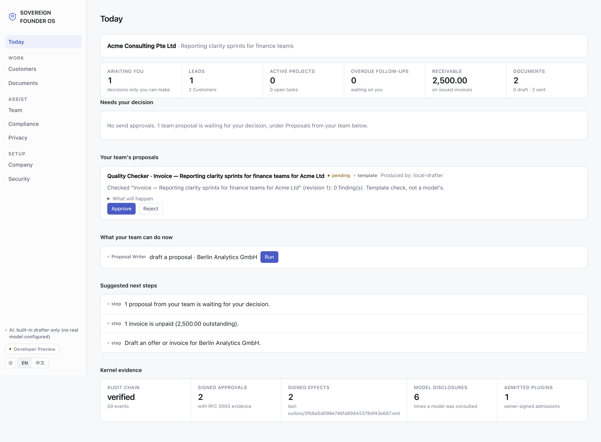
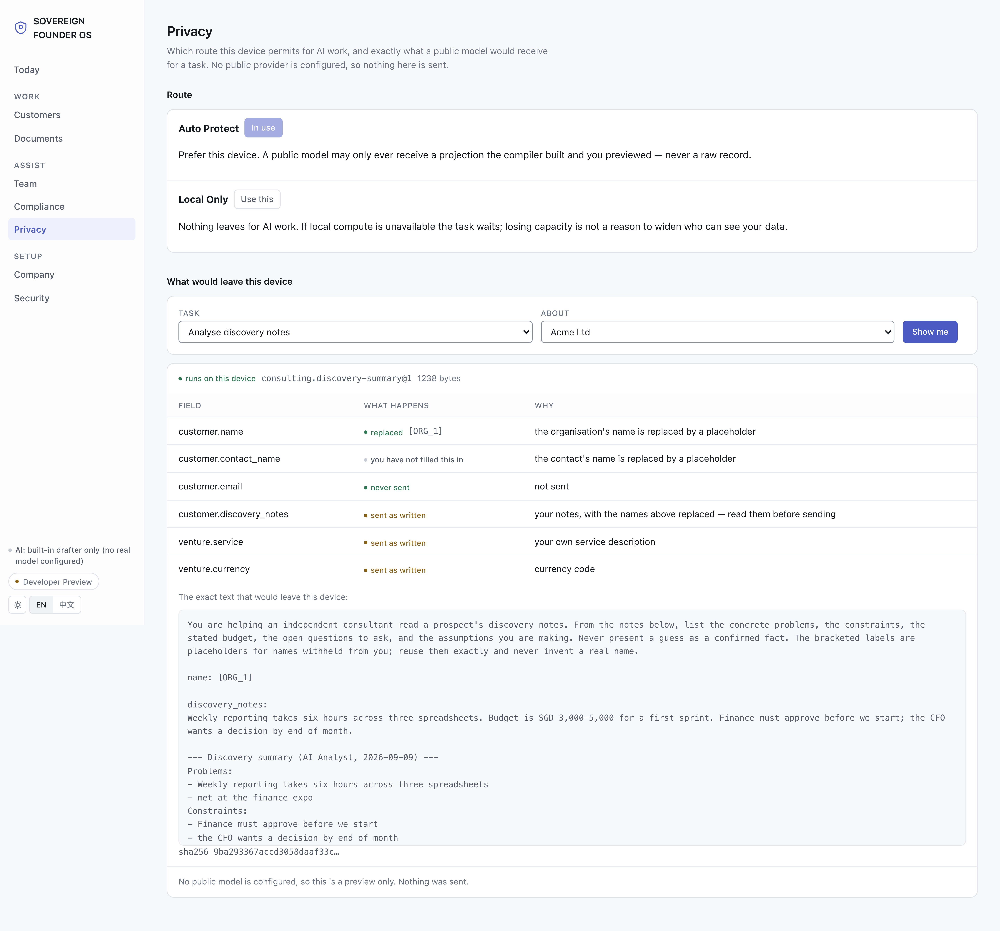
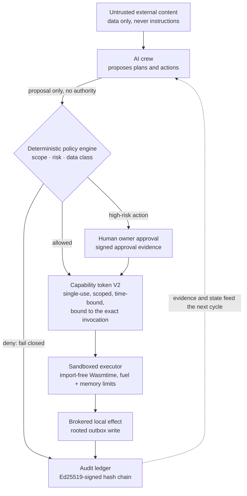
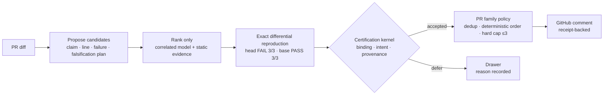

# Franz Xu

> **I build AI-native systems where the model proposes and a non-model kernel
> decides — so that capability grows without authority quietly following it.**

I am a developer and researcher working on secure agent infrastructure,
local-first systems, and reliable multi-agent decisions. Most AI products
optimize for producing an answer. I care about the step before that: **what an
agent is actually allowed to do, whose evidence counts, and whether the
evidence is strong enough to act.**

`Rust` · `Python` · agent runtimes · applied cryptography · AI evaluation

## Flagship — [Sovereign Founder OS](https://github.com/IcantFind-a-username/Sovereign-Founder-OS)

**A local-first operating system for running a one-person company with AI
agents — without surrendering data, decisions, or authority to any model or
provider.** This is my long-term work: 18 Rust crates, ~55k lines of Rust,
over 500 passing tests, and a desktop app you can install.

The company it operates is not chat history. It is a structured enterprise
graph — customers, projects, dated tasks, documents, invoices, receivables,
decisions — and every important effect on that graph passes a deterministic
policy gate before it happens and leaves a device-signed hash-chained record
after it does.

| Today — business state and what only the owner may decide | Privacy — exactly which bytes would leave this machine |
| --- | --- |
|  |  |

### Hire an AI employee in one click — and keep the authority

Six bounded roles: requirements analyst, proposal writer, delivery planner,
invoice clerk, quality checker, compliance checker. What makes them safe is
not the prompt, it is the plumbing around it:

- **Least privilege by construction.** Each role's prompt is built from a
  typed `RoleInput` carrying only the facts that role may see. A role cannot
  widen its own view of the company.
- **Employees propose; they never act.** `run_employee` returns a `Decision`
  and mutates nothing. Approval — `decide_proposal` — is what applies the
  exact recorded change. Hiring, pausing, approving and rejecting each pass a
  deterministic policy gate first.
- **Every role card states what it may never do**, in the product UI, not in
  a design doc: the invoice clerk *cannot issue, send, or collect anything*;
  the quality checker *cannot approve on your behalf or grant any other
  employee authority*; the compliance checker *cannot declare anything fully
  compliant, or replace a licensed professional*.
- **Honest provenance on every draft.** A local model (Ollama, loopback only)
  writes the proposal when its output validates; otherwise a deterministic
  template does — and the decision record says which one, and a refused model
  answer says which kind of wrong it was.

### The company's paperwork, with the boundary drawn first

- **Money and delivery.** Leads and customers with stage and consent,
  projects with dated tasks and acceptance criteria, drafts with revisions,
  signed send approvals, local RFC 5322 composition, revocation, receivables
  and recorded payments. The command-center aggregate is deliberately pure
  over stored state — it reads nothing new, writes nothing, and *makes no
  security claim of its own*.
- **Obligations, cited.** A 13-rule Singapore pack — GST registration and
  tax-invoice fields, e-invoicing, corporate tax and ECI, ACRA filings, PDPA
  consent and DPO, record keeping, contract essentials, cross-border
  customers. Every rule carries its issuing authority, source URL and the
  date it was read; a rule that is product convention rather than law is
  labelled `demo_rule` so it can never be mistaken for a statute. Findings
  are *pass / action / review / unknown* — never "compliant". Rule packs are
  data: a new jurisdiction is a new pack, not a change to the checker.
- **A disclosure boundary that cannot be argued around** (RFC 0004). Values
  arrive opaque and anything of unknown sensitivity defaults to *protected*.
  A registered, versioned transform must name every field it may read; a
  field it does not name is omitted, **so growing the data model cannot
  silently start disclosing**. Only the compiler can build a public-compute
  job, so no caller can assemble outbound bytes by declaring its own data
  safe. Two records differing only in protected values compile to identical
  payloads. The owner sees the exact outbound text and its SHA-256 before
  anything could be sent — and the crate states its own limit: this reduces
  what leaves, it does not make a public provider confidential.

### The kernel underneath

Authority never originates in the model. It comes from deterministic policy
and explicit owner approval, arrives as a single-use token bound to one
invocation, spends itself in a sandbox that cannot import a host interface,
and lands in an append-only chain a third party can verify offline.

A cross-crate adversarial suite attacks those invariants rather than the
features — prompt injection cannot authorize a high-risk action; protected
data cannot reach a cloud tool even with a self-issued token; capability
scope, expiry and replay are enforced; tampered capability and audit evidence
are rejected; path traversal is rejected before file access.

The desktop shell is held to the same standard. It owns a window and a child
process and nothing else: it launches the *audited* runtime binary, reads the
ephemeral loopback port the runtime chose, grants the webview no IPC, and
holds the runtime's stdin open — so if the shell dies by any means, the OS
closes the pipe and the runtime stops with it. **A window can never leave a
server running against your vault.**

### Where it stands — and where it does not

Sovereign Founder OS is a **Developer Preview**. The primitives are real; the
product boundary is not yet a production security boundary, and the
repository is specific about the gap rather than rounding up:

<!-- sfos-status:start -->
**Status** (auto-updated weekly): CI on `main`: passing · last commit: 2026-09-11 · 7 design RFCs · no tagged release · checked 2026-09-11
<!-- sfos-status:end -->

- **there is no authenticated owner session.** The loopback server rejects
  foreign `Host` headers and non-JSON mutations, but a local caller can read
  decrypted workspace data through the API. The synthetic-owner work (RFC
  0006) exists — and is fenced *off the product path by the compiler*: the
  whole crate sits behind a non-default feature, its outcome type is named
  `FixtureBootstrap`, it cannot be constructed outside its crate, and it
  depends on no authority, capability or effects code. A same-account process
  can win an empty-registry enrolment, so the fixture proves reproduction, never
  owner admission — and the type system is what stops a later reader from
  mistaking one for the other;
- **the audit chain is tamper-evident, not yet rollback-evident.**
  `verify_chain` proves each event links to its predecessor and was signed by
  the trusted device key — internal consistency and device binding. It proves
  nothing about age: an older, validly-signed *prefix* of the same chain
  passes. The freshness anchor that closes this is designed (RFC 0007) and
  not yet built;
- the vault encrypts entries, but its master key sits beside the data;
- the desktop bundle is ad-hoc signed, not notarized; AI employees have no
  tools, no autonomy and no network send.

The long-term benchmark is deliberately hard and openly labelled a research
target: *kill the model, the server, and the plugin — the company keeps
running.*

[Repository](https://github.com/IcantFind-a-username/Sovereign-Founder-OS) ·
[Manifesto](https://github.com/IcantFind-a-username/Sovereign-Founder-OS/blob/main/MANIFESTO.md) ·
[Architecture](https://github.com/IcantFind-a-username/Sovereign-Founder-OS/blob/main/ARCHITECTURE.md) ·
[Threat model](https://github.com/IcantFind-a-username/Sovereign-Founder-OS/blob/main/THREAT_MODEL.md) ·
[RFCs](https://github.com/IcantFind-a-username/Sovereign-Founder-OS/tree/main/rfcs) ·
[Roadmap](https://github.com/IcantFind-a-username/Sovereign-Founder-OS/blob/main/ROADMAP.md)

## Shipping — [Attest](https://github.com/IcantFind-a-username/Attest)

**Evidence-first AI code review: the model investigates, and a non-model
certification kernel decides what may be said.** The same separation as
Sovereign Founder OS, applied to a narrower problem — and packaged as a GitHub
Action.

Model agreement is treated as correlated ranking information, never as a vote
or a proof. A generated test runs repeatedly against the immutable head and the
merge base inside a secretless container; only the kernel can turn that
observation into an author-visible finding. Every red finding maps one-to-one
to a receipt binding the claim, hunk, exact test bytes, commands, interpreter,
environment, and controller seal — verifiable offline. A PR-level policy caps
the whole review at three findings.

- **The safety spine is on `main`** and has crossed the repository boundary: the
  Action installed on an outside repo, built its container on a hosted runner,
  ran a reproduction, and posted a real comment — a documented `DEFER`, not a
  claimed defect.
- **No borrowed certainty.** Across 100 recent change units the red path
  produced 21 accepted receipts and seven shadow findings; none published, none
  counted correct without independent adjudication.
- **The release gate is still red.** The preregistered null study stopped on a
  wrong publication twice; the open problem is distinguishing a regression from
  a deliberate value change. Private pilot, not a production service.
- **Failures are first-class output.** Budget exhaustion, unsupported
  execution, or inconclusive evidence become a named `DEFER`. Silence is an
  abstention, never a true negative.

[Repository](https://github.com/IcantFind-a-username/Attest) ·
[Architecture](https://github.com/IcantFind-a-username/Attest/blob/main/docs/architecture/target-algorithm.md) ·
[Design decisions](https://github.com/IcantFind-a-username/Attest/blob/main/DECISIONS.md)

## Research origin — [Corum](https://github.com/IcantFind-a-username/Corum)

Attest's statistical core was forged in Corum, a preregistered study of
dependence-aware consensus among imperfect AI reviewers. Its fail-closed
experiment returned an **honest negative result**: with a few near-independent
reviewers, no aggregation formula meaningfully beats reliability-weighted
voting. What survived the audit — calibrated posteriors that stay honest under
correlated evidence, and a redundancy discount that refuses to double-count
near-clone reviewers — became Attest. That discount was then priced, shipped,
and measured in production, where it has never changed an outcome; I report it
anyway. Corum falsified consensus *as evidence*; agreement is not confirmation,
disagreement is information. It stays frozen as the research record:
preregistration, locked judge, append-only ledgers, bit-reproducible results.

[Repository](https://github.com/IcantFind-a-username/Corum) ·
[Citation](https://github.com/IcantFind-a-username/Corum/blob/main/CITATION.cff)

## The through-line

Three projects, one question approached from three boundaries:

| Project | Question | Boundary |
| --- | --- | --- |
| **[Sovereign Founder OS](https://github.com/IcantFind-a-username/Sovereign-Founder-OS)** | What is an agent actually allowed to do? | Authority and execution |
| **[Attest](https://github.com/IcantFind-a-username/Attest)** | Is the evidence strong enough to speak? | Epistemic reliability |
| **[US Stock Helper](https://github.com/IcantFind-a-username/us-stock-helper)** | How can an AI assist without taking control? | Read-only decision support |

[US Stock Helper](https://github.com/IcantFind-a-username/us-stock-helper) is an
in-development, read-only research copilot for U.S. equities: it analyzes
completed bars for TD Setup, candlestick patterns, and order-flow participation
proxies. No package contains a broker, trade context, or order-submission
interface — it analyzes, never places orders.

## Background

At the University of Twente, I moved from Technical Computer Science into
Business Information Technology to work where software engineering, business
systems, and product meet. After a bachelor's thesis on machine-learning
predictive modelling, I am now pursuing an MSc in Blockchain Technology at
Nanyang Technological University, Singapore.

My recent industry work includes designing and primarily implementing the
upstream Requirement Agent for ICBC's in-house QUEST platform (2026), alongside
work on multi-agent consensus evaluation. Earlier projects lived primarily on
GitLab.

## Connect

I am actively looking for full-time roles in AI systems, security, or
infrastructure. I am also open to research conversations and collaboration on
secure agent runtimes or reliable multi-agent systems.

[LinkedIn](https://www.linkedin.com/in/yiqun-xu-8627a8264) ·
[Email](mailto:franzxu28@gmail.com) ·
[Sovereign Founder OS issues](https://github.com/IcantFind-a-username/Sovereign-Founder-OS/issues)
