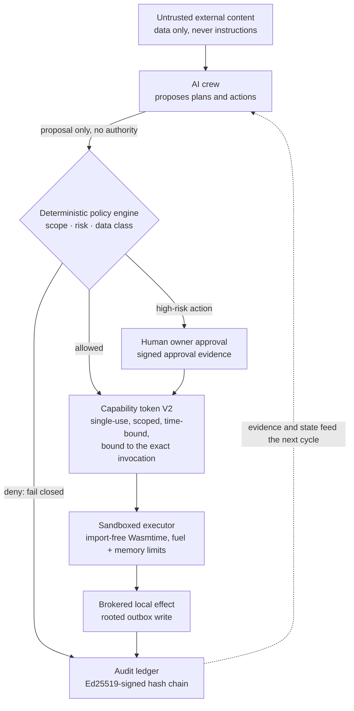

# Franz Xu

> **An LLM proposes; something that calls no model decides whether it may act, or
> speak.** I build the deciding half — and the evidence it leaves behind.

Most AI systems optimize for producing an answer. I work on the step before
that: what an agent is actually allowed to do, whose evidence counts, and
whether the evidence is strong enough to act. Both projects below are the same
argument, at different boundaries, and both are honest about how far they are
from done.

`Rust` · `Python` · agent runtimes · applied cryptography · AI evaluation

## [Sovereign Founder OS](https://github.com/IcantFind-a-username/Sovereign-Founder-OS) — where authority comes from

**A local-first operating system for running a one-person company with AI
agents — without surrendering data, decisions, or authority to any model or
provider.** My long-term work: 18 Rust crates, over 500 passing tests, seven
design RFCs, and a macOS app you can install.

The company it runs is not chat history. It is a structured graph — customers,
projects, dated tasks, documents, invoices, receivables, decisions — and every
important effect on it passes a deterministic policy gate before it happens and
leaves a device-signed hash-chained record after it does.

| Today — the business state, and what only the owner may decide | Privacy — exactly which bytes would leave this machine |
| --- | --- |
|  |  |

You hire six bounded AI employees — requirements analyst, proposal writer,
delivery planner, invoice clerk, quality checker, compliance checker — and they
draft your discovery notes, proposals, plans, invoices and compliance reports.
What makes them safe is not the prompt:

- **Least privilege by construction.** Each role's prompt is built from a typed
  `RoleInput` carrying only the facts that role may see; a role cannot widen its
  own view of the company.
- **They propose; they never act.** `run_employee` returns a `Decision` and
  mutates nothing — your approval applies the exact recorded change, and hiring,
  approving and rejecting each pass a policy gate first. Every role card names
  what it may never do: the invoice clerk *cannot issue, send, or collect
  anything*; the quality checker *cannot approve on your behalf*.
- **Honest provenance.** A local model (Ollama, loopback only) writes the draft
  when its output validates; otherwise a deterministic template does — and the
  record says which, and a refused answer says which kind of wrong it was.
- **Obligations, cited.** A 13-rule Singapore pack — GST, corporate tax, ACRA,
  PDPA, record keeping, cross-border customers — where every rule carries its
  issuing authority and the date its source was read, and findings are *pass /
  action / review / unknown*, never "compliant".

Authority never originates in the model. It comes from deterministic policy and
explicit owner approval, arrives as a single-use token bound to one invocation,
spends itself in a sandbox that cannot import a host interface, and lands in an
append-only chain a third party can verify offline. Before anything may reach a
public model, a versioned transform must name every field it discloses — a field
it does not name is omitted, **so growing the data model cannot silently start
disclosing** — and the owner sees the exact outgoing bytes and their hash first.
A cross-crate adversarial suite attacks those invariants rather than the
features: prompt injection cannot authorize a high-risk action, protected data
cannot reach a cloud tool even with a self-issued token, tampered evidence is
rejected.

**Where it stands.** A Developer Preview. The primitives are real; the product
boundary is not yet a production security boundary:

<!-- sfos-status:start -->
**Status** (auto-updated weekly): CI on `main`: passing · last commit: 2026-09-11 · 7 design RFCs · no tagged release · checked 2026-09-11
<!-- sfos-status:end -->

- **No authenticated owner session yet** — a local caller can read decrypted
  workspace data through the loopback API, and the vault's master key sits
  beside the data.
- **The audit chain is tamper-evident, not yet rollback-evident**: it proves
  each event links to its predecessor and was signed by the trusted device, but
  an older valid *prefix* still passes until RFC 0007's freshness anchor lands.
- **The owner-session work is fenced off the product path by the compiler** —
  behind a non-default feature, its outcome type named `FixtureBootstrap` and
  unconstructible elsewhere — because a same-account process can win an
  empty-registry enrolment, so the fixture proves reproduction, never owner
  admission.

[Manifesto](https://github.com/IcantFind-a-username/Sovereign-Founder-OS/blob/main/MANIFESTO.md) ·
[Architecture](https://github.com/IcantFind-a-username/Sovereign-Founder-OS/blob/main/ARCHITECTURE.md) ·
[Threat model](https://github.com/IcantFind-a-username/Sovereign-Founder-OS/blob/main/THREAT_MODEL.md) ·
[RFCs](https://github.com/IcantFind-a-username/Sovereign-Founder-OS/tree/main/rfcs) ·
[Roadmap](https://github.com/IcantFind-a-username/Sovereign-Founder-OS/blob/main/ROADMAP.md)

## [Attest](https://github.com/IcantFind-a-username/Attest) — whether the evidence may speak

**A pull-request reviewer that only says things it can prove, and abstains out
loud when it cannot.** A GitHub Action; the same separation as above, applied to
code review.

A defect claim is published only when a generated test **fails on your head
commit and passes on the merge base**, three runs each way, inside a
network-free container, with a receipt anyone can verify offline. A score
decides only which three findings an author sees — never whether a claim is
true. Four levels of speech never borrow each other's words, and each one's
status is published, not implied: red is live, green is live, the gate level is
in shadow and has found a publishing-grade witness on **0 of 445** recorded
candidates, and one yellow class is closed because it produced nothing under two
rule versions.

The number I lead with is the unflattering one: **measured recall on a held-out
defect corpus is 6.5%.** It is silent far more often than it speaks, and a
silence from it is never evidence that your code is fine. What that buys is the
other column — **zero false publications** across 68 independent null controls
and 40 held-out controls, and across a prospective shadow run over 28 real pull
requests. Precision is undefined, because nothing was certified; I report it
that way rather than rounding it into a win.

[Repository](https://github.com/IcantFind-a-username/Attest) ·
[Changelog](https://github.com/IcantFind-a-username/Attest/blob/main/CHANGELOG.md) ·
[Decision log](https://github.com/IcantFind-a-username/Attest/blob/main/DECISIONS.md)

## How I run these projects

The engineering I care about most is the part that constrains me later:

- **Designs land as RFCs before code.** Seven of them, each stating its
  non-negotiable invariants and, where relevant, what it explicitly does *not*
  claim. RFC 0006 exists mainly to say what a fixture may never be mistaken for.
- **Threat model, security policy, and scope are written down** — including what
  is out of scope for a report, and what a security researcher can expect back.
- **Guardrails are scripts CI runs, not intentions.** Pinned toolchain, clippy
  at `-D warnings` on test targets too, file-size ceilings, secret scanning,
  dependency review, SBOM and provenance evidence, and boundary checks that fail
  the build if fixture-only code drifts toward the product path.
- **Failures are first-class output.** A named abstention, a recorded `DEFER`, a
  "could not run" that never reads as "clean" — in both projects a check that
  did not execute must not be able to return success.
- **Release gates refuse rather than round up.** Sovereign Founder OS ships a
  release workflow whose only job today is to report that automatic publication
  is disabled because the documented gates are not implemented yet.
- **Negative results get published.** [Corum](https://github.com/IcantFind-a-username/Corum),
  the preregistered study Attest's statistics came from, returned an honest
  negative: with a few near-independent reviewers, no aggregation formula
  meaningfully beats reliability-weighted voting. The one survivor carried into
  Attest — a redundancy discount that refuses to double-count near-clone
  reviewers — was priced, shipped, measured, and has never changed an outcome. I
  report that too. It stays frozen as the research record.

## The through-line

| Project | Question | Boundary |
| --- | --- | --- |
| **[Sovereign Founder OS](https://github.com/IcantFind-a-username/Sovereign-Founder-OS)** | What is an agent actually allowed to do? | Authority and execution |
| **[Attest](https://github.com/IcantFind-a-username/Attest)** | Is the evidence strong enough to speak? | Epistemic reliability |
| **[US Stock Helper](https://github.com/IcantFind-a-username/us-stock-helper)** | How can an AI assist without taking control? | Read-only decision support |

## Background

At the University of Twente I moved from Technical Computer Science into
Business Information Technology, to work where software engineering, business
systems, and product meet. After a bachelor's thesis on machine-learning
predictive modelling, I am now pursuing an MSc in Blockchain Technology at
Nanyang Technological University, Singapore. My recent industry work includes
designing and primarily implementing the upstream Requirement Agent for ICBC's
in-house QUEST platform (2026).

## Connect

Open to full-time roles in AI systems, security, or infrastructure, and to
collaboration on secure agent runtimes or reliable multi-agent systems.
Contributions are welcome — both repositories document where to start, and
security reports have their own channel.

[LinkedIn](https://www.linkedin.com/in/yiqun-xu-8627a8264) ·
[Email](mailto:franzxu28@gmail.com) ·
[Contributing](https://github.com/IcantFind-a-username/Sovereign-Founder-OS/blob/main/CONTRIBUTING.md) ·
[Security policy](https://github.com/IcantFind-a-username/Sovereign-Founder-OS/blob/main/SECURITY.md)
