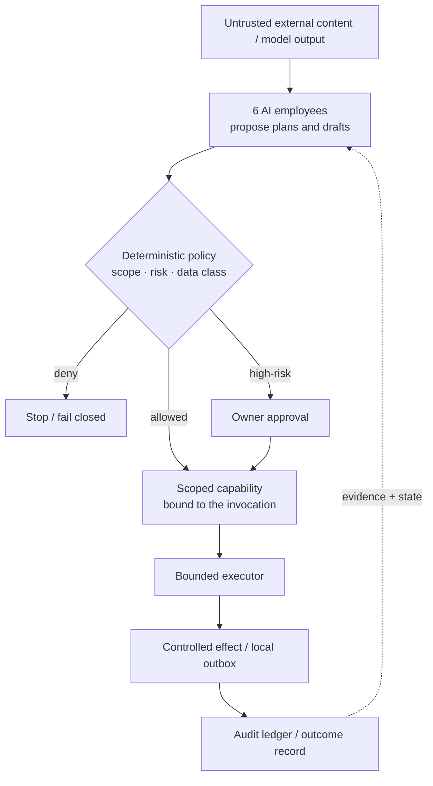

# Franz Xu

[](https://ghcommits.com/u/IcantFind-a-username)

> **I build AI-native systems where probabilistic models meet deterministic software boundaries.**

MSc Blockchain Technology @ Nanyang Technological University, Singapore · graduating **Jan 2027**

`AI systems` · `agent infrastructure` · `Rust` · `Python` · `blockchain` · `applied cryptography` · `systems engineering`

## What I am working on now

My main direction remains **AI systems / agent engineering**: building software around agents with explicit execution boundaries, evidence, failure semantics, and deterministic checks where they matter.

I am also actively shipping consumer products. **Miao Care (喵护)**, a cat-care companion I developed, is now live on iOS. I am currently pushing **OneTapVocal** toward release — an intelligent singing-video vocal-tuning product designed to make vocal correction and enhancement accessible from a mobile workflow, with an iOS App Store launch planned next.

At the same time, I am deepening the other half of my background — **hands-on blockchain engineering**. My current private engineering track is a DeFi liquidation/search system: historical on-chain replay, mainnet-fork simulation, liquidation economics, and eventually live shadow execution. This is not a career pivot away from AI; it is a way to add real EVM / DeFi / on-chain systems experience to a foundation that already includes L1/L2, scalability, privacy, and cryptography coursework.

I am deliberately keeping the current blockchain execution/search strategy private while it is being developed.

---

## Shipping & building

### Miao Care (喵护) — shipped on iOS

A cat-care companion focused on making day-to-day care easier to track and understand. I developed the product from concept through implementation and iOS release.

**Status:** live on the iOS App Store.

### OneTapVocal — building toward iOS release

An intelligent singing-video vocal-tuning product. The current focus is turning a technically involved audio-processing workflow into a simple mobile experience instead of exposing the complexity of the underlying pipeline.

**Status:** active development · iOS App Store release planned next.

These product projects are intentionally different from my research-heavy systems work: they keep me close to **shipping, product judgment, mobile UX, iteration speed, and real users**.

---

## Selected systems & research work

### [Sovereign Founder OS](https://github.com/IcantFind-a-username/Sovereign-Founder-OS) — one-person company product prototype

[](https://github.com/IcantFind-a-username/Sovereign-Founder-OS)
[](https://github.com/IcantFind-a-username/Sovereign-Founder-OS/blob/main/LICENSE)
[](https://github.com/IcantFind-a-username/Sovereign-Founder-OS)

**Sovereign Founder OS is my attempt at a local-first operating workspace for a one-person company.** The product prototype combines a simple founder-facing UI, structured company state, six bounded AI employees, and a Rust security-oriented execution layer underneath.

The product side is intentionally concrete: customers, projects, documents, invoices, receivables, team proposals, suggested next steps, and owner decisions are represented as structured state rather than disappearing into chat history.

The six AI employee roles cover different responsibilities:

- **Requirements Analyst** — turns discovery material into structured problems, constraints, and open questions;
- **Proposal Writer** — drafts offers and proposals from approved company context;
- **Delivery Planner** — turns accepted work into delivery plans and tasks;
- **Invoice Clerk** — prepares invoice-related drafts without issuing or collecting on the owner's behalf;
- **Quality Checker** — reviews work products and reports findings without approving for the owner;
- **Compliance Checker** — surfaces rule-backed issues and uncertainty without pretending to replace a licensed professional.

The important design rule is that these AI employees **propose; they do not own authority**. High-impact effects are mediated by deterministic policy, explicit approval where required, scoped capabilities, bounded execution, and recorded outcomes.

### Product UI

| Today — company state, proposals, owner decisions | Privacy — preview exactly what AI work may expose |
| --- | --- |
|  |  |

The **Today** view is the founder's control surface: outstanding decisions, leads, active work, receivables, AI-team proposals, suggested next steps, and kernel evidence are visible in one place.

The **Privacy** view explores a different problem: before work is routed to a public model, the user can inspect what fields would leave the device, what is withheld or replaced, and the exact compiled text that would be sent. `Local Only` remains the strict path when nothing should leave the device. This is still a developer-preview boundary, not a claim of complete production confidentiality.

### Kernel path



I focused heavily on the security-oriented core: scoped capability proofs, deterministic policy gates, execution journals with explicit ambiguous states, bounded Wasm execution, structured audit evidence, and local-first state. The workspace grew to **18 Rust crates and 571 Rust tests**.

The project is a **Developer Preview / product prototype**, not a finished production security boundary. Active feature development is currently paused while I focus my limited development time on other products and on-chain engineering, but SFOS remains one of my main systems projects and the clearest expression of how I think about AI agents as software rather than chat interfaces.

What I took from it:

- intelligence and authority should not be treated as the same thing;
- useful AI agents need product state, workflows, and explicit effects, not just prompts;
- security claims need explicit threat models and honest limitations;
- crash / ambiguous-effect states deserve first-class semantics rather than fake success;
- privacy UX matters: users should be able to see what information a model would actually receive;
- a smaller, understandable trusted boundary is usually more valuable than a feature-rich one.

[Repository](https://github.com/IcantFind-a-username/Sovereign-Founder-OS) · [Architecture](https://github.com/IcantFind-a-username/Sovereign-Founder-OS/blob/main/ARCHITECTURE.md) · [Threat model](https://github.com/IcantFind-a-username/Sovereign-Founder-OS/blob/main/THREAT_MODEL.md) · [RFCs](https://github.com/IcantFind-a-username/Sovereign-Founder-OS/tree/main/rfcs)

---

### [Attest](https://github.com/IcantFind-a-username/Attest) — AI evaluation / evidence-backed review

[](https://github.com/IcantFind-a-username/Attest/releases/latest)
[](https://github.com/marketplace/actions/attest-pull-request-review)
[](https://github.com/IcantFind-a-username/Attest/blob/main/pyproject.toml)
[](https://github.com/IcantFind-a-username/Attest)

**Evidence-first AI code review: the model investigates; a non-model certification kernel decides what is strong enough to publish.**

Attest shipped publicly as an experimental GitHub Action and reached **`v0.3.0`**. Generated tests run against the PR head and merge base inside a network-free / secretless container; accepted defect claims are backed by reproducible receipts rather than model confidence alone.

The `v0.3.0` evaluation reports **68 merged pull requests across 19 open-source Python libraries**. Attest produced 14 review lines across 10 PRs; of the adjudicated lines, **4 were useful, 3 were true but not actionable, 0 were judged wrong**, with 7 lines still pending adjudication at release time. On the 40 injected forward-defect corpus, crash-class recall was **13/40 (32.5%)** under the release's default probe configuration. The project explicitly treats silence as abstention rather than a true negative.

**Active development is currently paused after `v0.3.0`.** This is a bandwidth decision: my individual development time is currently going into other products and engineering work, not a claim that Attest is finished or that the underlying idea has been abandoned.

Attest remains a concrete experiment in **abstention, falsification, deterministic gates, evidence provenance, differential reproduction, and the separation between model judgment and publishable claims**.

[Latest release](https://github.com/IcantFind-a-username/Attest/releases/tag/v0.3.0) · [Marketplace](https://github.com/marketplace/actions/attest-pull-request-review) · [Repository](https://github.com/IcantFind-a-username/Attest) · [Receipts](https://github.com/IcantFind-a-username/Attest/blob/main/docs/receipts.md) · [Design decisions](https://github.com/IcantFind-a-username/Attest/blob/main/DECISIONS.md)

---

### [Corum](https://github.com/IcantFind-a-username/Corum) — research / multi-model verification

[](https://github.com/IcantFind-a-username/Corum)

Corum was a preregistered study of dependence-aware consensus among imperfect AI reviewers. The useful outcome was partly negative: **agreement between models is not automatically independent evidence**, and more aggregation machinery does not magically create a trustworthy confidence guarantee.

That result pushed my later work toward harder separation between probabilistic judgment and deterministic publication / execution rules.

[Repository](https://github.com/IcantFind-a-username/Corum) · [Citation](https://github.com/IcantFind-a-username/Corum/blob/main/CITATION.cff)

---

## Current engineering track — on-chain systems

I am currently using my blockchain background to build deeper **real-chain engineering experience**, not to replace my AI systems direction.

The current private project starts deliberately small:

```text
historical Morpho liquidation
        ↓
reconstruct pre-liquidation state
        ↓
liquidation / oracle / PnL math
        ↓
Foundry + mainnet-fork reproduction
        ↓
live shadow searcher
        ↓
only then consider real execution
```

This work is intended to exercise the full path from protocol mechanics to RPC/state reconstruction, Solidity/Foundry, transaction simulation, DeFi economics, DEX execution, gas/MEV constraints, and on-chain debugging.

My academic blockchain foundation includes **L1/L2 design, consensus/BFT, scalability, rollups, data availability, privacy, smart contracts, and cryptography**. The current goal is to connect that theory to a system that actually observes and interacts with live chain state.

---

## The through-line

These projects are different, but they share a systems mindset:

> **Build quickly, but make authority, evidence, assumptions, and failure modes explicit enough to reason about.**

| Area | What I have been exploring |
| --- | --- |
| **AI systems** | agents, execution boundaries, reliability, evaluation, human escalation |
| **Systems engineering** | Rust, explicit state machines, least privilege, provenance, failure semantics |
| **Blockchain** | L1/L2 foundations, cryptography, smart contracts, DeFi/on-chain execution |
| **Product engineering** | shipping mobile products, UX, iteration, turning complex pipelines into usable software |
| **Research engineering** | negative results, adversarial testing, reproducibility, calibrated claims |

I use modern AI coding tools aggressively to increase implementation speed, while treating architecture, assumptions, tests, and system understanding as the parts I still need to own.

---

## Background

I am pursuing an **MSc in Blockchain Technology at Nanyang Technological University**. My coursework has covered blockchain privacy and scalability, L1/L2 mechanisms, cryptography, smart contracts, and related distributed-systems foundations.

Before NTU, I studied **Business Information Technology at the University of Twente**, where my work combined software engineering, data, systems, and product-oriented project development.

Recent industry work includes designing and primarily implementing the upstream **Requirement Agent for ICBC's in-house QUEST platform**, together with work on multi-model evaluation and reliable AI-agent workflows.

---

## Roles I am interested in

For 2027 graduate / early-career roles, my primary interests remain:

- **AI Systems / Agent Engineer**
- **Applied AI / AI Infrastructure Engineer**
- **Systems / Reliability / Developer Infrastructure**

My blockchain background also gives me a second strong direction in:

- **Blockchain / DeFi Engineering**
- **Protocol / Digital-Asset Infrastructure**
- **Blockchain Security / on-chain systems**

I am most interested in roles where I can combine **AI-assisted engineering speed with systems-level reasoning**, rather than treating either AI or blockchain as a thin API layer.

## Connect

[LinkedIn](https://www.linkedin.com/in/yiqun-xu-8627a8264) · [Email](mailto:franzxu28@gmail.com)
