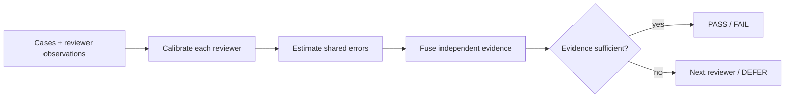

# Franz Xu

> **I build AI systems that know what they can trust — and when they should defer.**

I am a developer and researcher working on reliable multi-agent decisions,
secure agent infrastructure, and local-first systems. Most AI products optimize
for producing an answer. I care about the step before that: **whose evidence
counts, how much it counts, and whether the evidence is strong enough to act.**

`Python` · `Rust` · AI evaluation · distributed systems · applied cryptography

## Featured project — [Corum](https://github.com/IcantFind-a-username/Corum)

**Evidence-aware, dependence-aware consensus for reliable multi-model
decisions.**

Corum is a general-purpose framework for combining judgments from imperfect AI
reviewers. It is designed for the cases where majority vote is not enough:
reviewers have different error rates, several may repeat the same underlying
mistake, and sometimes the honest outcome is *not enough evidence*.

### What makes it different

- **Calibration, not reputation.** Corum learns each reviewer's `2 × 3`
  observation likelihood from labeled data and propagates Dirichlet calibration
  uncertainty instead of treating an accuracy score as exact.
- **Correlation is not consensus.** Dependence weights reduce duplicated
  evidence from near-clone reviewers without counting reliability twice.
- **Missing is not negative.** `ABSTAIN`, `TIMEOUT`, `INVALID`, `REFUSAL`, and
  `NOT_CALLED` remain distinct states rather than being silently discarded.
- **Deferral is a valid result.** Conservative posterior thresholds, quorum, and
  effective sample size lead to `PASS`, `FAIL`, or an explicit `DEFER`.
- **Evaluation before spectacle.** The project uses deterministic tests,
  controlled simulations, and public-data replay before any paid live-model
  experiment.

### Current state

`v0.1.0` currently includes the typed data model, reviewer calibration, and
dependence estimation, with focused tests for the statistical core. Posterior
fusion, risk-aware decisions, the adaptive reviewer cascade, simulation
benchmarks, and the reproducible HaluEval path are the next MVP milestones.
Synthetic and real-model results will be reported separately.

[Repository](https://github.com/IcantFind-a-username/Corum) ·
[MVP design](https://github.com/IcantFind-a-username/Corum/blob/main/docs/superpowers/specs/2026-08-28-corum-mvp-design.md) ·
[Implementation plan](https://github.com/IcantFind-a-username/Corum/blob/main/docs/superpowers/plans/2026-08-28-corum-mvp.md) ·
[Citation](https://github.com/IcantFind-a-username/Corum/blob/main/CITATION.cff)

## The broader work

These projects approach trustworthy AI from three different boundaries:

| Project | Question | Boundary |
| --- | --- | --- |
| **[Corum](https://github.com/IcantFind-a-username/Corum)** | Is there enough independent evidence to decide? | Epistemic reliability |
| **[Sovereign Founder OS](https://github.com/IcantFind-a-username/Sovereign-Founder-OS)** | What is an agent actually allowed to do? | Authority and execution |
| **[US Stock Helper](https://github.com/IcantFind-a-username/us-stock-helper)** | How can an AI assist without taking control? | Read-only decision support |

### [Sovereign Founder OS](https://github.com/IcantFind-a-username/Sovereign-Founder-OS)

A local-first, open-source system for running a one-person company with AI
agents **without surrendering data, decisions, or authority** to a model or
provider. Its core rule is simple: what the model suggests and what the system
allows are separate.

The Developer Preview is a 16-member Rust workspace with deterministic policy,
single-use capability tokens, a Wasmtime sandbox, encrypted local state, and an
Ed25519-signed hash-chained audit ledger. The full end-to-end workflow remains
experimental, and the repository distinguishes implemented primitives from
planned hardening work.

The target authority loop keeps model output at proposal level. Deterministic
policy and explicit human approval grant narrowly scoped authority; sandboxed
execution and the signed audit ledger then make each important effect bounded
and traceable.

[Architecture](https://github.com/IcantFind-a-username/Sovereign-Founder-OS/blob/main/ARCHITECTURE.md) ·
[Threat model](https://github.com/IcantFind-a-username/Sovereign-Founder-OS/blob/main/THREAT_MODEL.md) ·
[Roadmap](https://github.com/IcantFind-a-username/Sovereign-Founder-OS/blob/main/ROADMAP.md)

### [US Stock Helper](https://github.com/IcantFind-a-username/us-stock-helper)

An in-development, read-only AI research copilot for U.S. equities. It analyzes
completed bars for TD Setup, candlestick patterns, and order-flow participation
proxies. No package contains a broker, trade context, or order-submission
interface: it analyzes, never places orders.

## Background

At the University of Twente, I moved from Technical Computer Science into
Business Information Technology to work where software engineering, business
systems, and product meet. After a bachelor's thesis on machine-learning
predictive modelling, I am now pursuing an MSc in Blockchain Technology at
Nanyang Technological University, Singapore.

My recent industry work includes designing and primarily implementing the
upstream Requirement Agent for ICBC's in-house QUEST platform (2026), alongside
work on multi-agent consensus evaluation. Earlier projects lived primarily on
GitLab.

## Connect

I am actively looking for full-time roles in AI systems, security, or
infrastructure. I am also open to research conversations and collaboration on
reliable multi-agent systems or secure agent runtimes.

[LinkedIn](https://www.linkedin.com/in/yiqun-xu-8627a8264) ·
[Email](mailto:franzxu28@gmail.com) ·
[Corum issues](https://github.com/IcantFind-a-username/Corum/issues)

