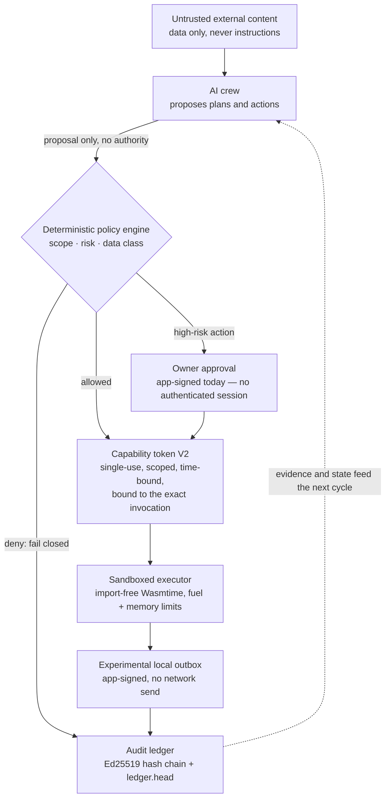
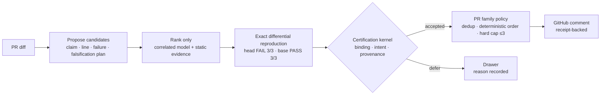

# Franz Xu

> **Models propose. A non-model kernel decides. I work on that boundary.**

I build local-first agent runtimes and evidence-backed review. The interesting
step is not the answer. It is what an agent is allowed to do, whose evidence
counts, and whether that evidence is strong enough to act.

`Rust` · `Python` · agent runtimes · applied cryptography · AI evaluation

## Flagship — [Sovereign Founder OS](https://github.com/IcantFind-a-username/Sovereign-Founder-OS)

A local-first founder workspace: structured company state, policy-gated
effects, a device-signed audit chain. Developer Preview. 18 crates. 571 Rust
tests (`cargo test --workspace --locked -- --list`). Tens of thousands of
lines of Rust. No product `v0.1` tag; a preview, if tagged, would be
`developer-preview-*`.

The company is not chat history. It is an enterprise graph — customers,
projects, dated tasks, documents, invoices, receivables, decisions. Effects
that matter pass a deterministic policy gate and leave a hash-chained record.

| Today — business state and what only the owner may decide | Privacy — exposure preview for one task |
| --- | --- |
|  |  |

### Bounded AI roles

Six roles: requirements analyst, proposal writer, delivery planner, invoice
clerk, quality checker, compliance checker. The constraint is in the plumbing,
not the prompt.

- **Least privilege by construction.** Each role's prompt is built from a
  typed `RoleInput` carrying only the facts that role may see. A role cannot
  widen its own view of the company.
- **Employees propose; they do not act.** `run_employee` returns a `Decision`
  and mutates nothing. Approval — `decide_proposal` — applies the exact
  recorded change. Hiring, pausing, approving, and rejecting each pass a
  deterministic policy gate first.
- **Each role card states what it may never do**, in the product UI: the
  invoice clerk cannot issue, send, or collect; the quality checker cannot
  approve on the owner's behalf; the compliance checker cannot declare
  anything fully compliant or replace a licensed professional.
- **Provenance on every draft.** A local model (Ollama, loopback only) writes
  the proposal when its output validates; otherwise a deterministic template
  does. The decision record says which, and a refused model answer says which
  kind of wrong it was. Ollama is a separate process this product routes to.
  It is not sandboxed or digest-bound.

### Company records

- **Money and delivery.** Leads and customers with stage and consent;
  projects with dated tasks and acceptance criteria; drafts with revisions;
  signed send approvals; local RFC 5322 composition; revocation; receivables
  and recorded payments. The command-center aggregate is pure over stored
  state — it reads nothing new, writes nothing, and makes no security claim
  of its own.
- **Obligations, cited.** A 13-rule Singapore pack — GST, tax-invoice fields,
  e-invoicing, corporate tax and ECI, ACRA, PDPA, record keeping, contract
  essentials, cross-border customers. Every rule carries its issuing
  authority, source URL, and the date it was read. A product convention is
  labelled `demo_rule`. Findings are *pass / action / review / unknown* —
  never "compliant". A new jurisdiction is a new pack, not a change to the
  checker.
- **Disclosure — Current vs Target.** The `privacy` crate is designed so
  values arrive opaque, unknown sensitivity defaults to protected, and a
  registered transform must name every field it may read. The UI can preview
  compiled outbound text and its SHA-256. That is partial work, not the
  product boundary. **RFC 0004 remains a v0.2 Target.** The model gateway is
  Experimental: caller labels and provider self-report can still authorize
  unsafe Amber/Green routes. `Local Only` zero-egress and compiler-owned
  public projection are not current. The crate states its own limit: a
  preview reduces what a job *would* contain; it does not make a public
  provider confidential, and it does not by itself stop a gateway route.

### The kernel

Authority does not originate in the model. On this path it comes from
deterministic policy and an approval record, arrives as a single-use token
bound to one invocation, spends itself in a sandbox that cannot import a host
interface, and lands in an append-only chain a third party can verify offline.
Today the approval and the outbox write are **Experimental and app-signed**.
They are not independently authenticated owner intent.

A cross-crate adversarial suite attacks those invariants rather than the
features: prompt injection cannot authorize a high-risk action; capability
scope, expiry, and replay are enforced; tampered capability and audit evidence
are rejected; path traversal is rejected before file access. It does not prove
RFC 0004's product disclosure boundary.

The desktop shell owns a window and a child process. It launches the audited
runtime binary, reads the ephemeral loopback port the runtime chose, grants
the webview no IPC, and holds the runtime's stdin open. If the shell dies,
the OS closes the pipe and the runtime stops with it.

### Where it stands

Sovereign Founder OS is a **Developer Preview**. The primitives are real. The
product path is not a production security boundary.

<!-- sfos-status:start -->
**Status** (auto-updated weekly): CI on `main`: passing · last commit: 2026-09-13 · 7 design RFCs · no tagged release · checked 2026-09-13
<!-- sfos-status:end -->

- **No authenticated owner session on the product path.** The loopback server
  rejects foreign `Host` headers and non-JSON mutations, but a local caller
  can read decrypted workspace data through the API. RFC 0006's synthetic
  owner work exists and is fenced *off the product path by the compiler*:
  the crate sits behind a non-default feature, its outcome type is
  `FixtureBootstrap`, it cannot be constructed outside its crate, and it
  depends on no authority, capability, or effects code. A same-account
  process can win an empty-registry enrolment, so the fixture proves
  reproduction, never owner admission. **Product 1C0 admission is deferred
  to v0.2.**
- **Outbox is Experimental and app-signed.** The backend creates the owner
  signature after an unauthenticated local API decision. The capability binds
  document preparation, not the final recipient and exact RFC 5322 bytes.
  The app performs no network send; “delivered” is a locally entered marker.
- **Ledger freshness (RFC 0007) is on `main`.** `ledger.head` is a
  device-signed sidecar. Workspace open and `integrity_check` refuse a
  prefix rewind when the anchor outlives the chain. **Whole-directory
  rollback is not detected:** `device.json`, `ledger.json`, and
  `ledger.head` sit together; an actor who can rewrite the directory can
  re-sign a fresh anchor.
- **Vault key custody is still the Experimental residual.** Entries are
  encrypted; the master key sits beside the data. The vault-v2 Program 1A
  engine exists (`crates/vault-v2-engine`, `publish = false`) and is not on
  the product path: no enrollment, no workspace migration, no backup or
  recovery claim.
- The desktop bundle is ad-hoc signed, not notarized. AI employees have no
  tools, no autonomy, and no network send.

The long-term benchmark is labelled a research target, not a current claim:
*kill the model, the server, and the plugin — the company keeps running.*

[Repository](https://github.com/IcantFind-a-username/Sovereign-Founder-OS) ·
[Manifesto](https://github.com/IcantFind-a-username/Sovereign-Founder-OS/blob/main/MANIFESTO.md) ·
[Architecture](https://github.com/IcantFind-a-username/Sovereign-Founder-OS/blob/main/ARCHITECTURE.md) ·
[Threat model](https://github.com/IcantFind-a-username/Sovereign-Founder-OS/blob/main/THREAT_MODEL.md) ·
[RFCs](https://github.com/IcantFind-a-username/Sovereign-Founder-OS/tree/main/rfcs) ·
[Roadmap](https://github.com/IcantFind-a-username/Sovereign-Founder-OS/blob/main/ROADMAP.md)

## Shipping — [Attest](https://github.com/IcantFind-a-username/Attest)

**Evidence-first AI code review: the model investigates; a non-model
certification kernel decides what may be said.** The same separation as
Sovereign Founder OS, on a narrower problem — shipped as a GitHub Action
(`v0.2.0`). Experimental.

Model agreement is correlated ranking information, never a vote or a proof.
A generated test runs against the immutable head and the merge base inside a
secretless container; only the kernel can turn that observation into an
author-visible finding. Every red finding maps one-to-one to a receipt
binding the claim, hunk, exact test bytes, commands, interpreter,
environment, and controller seal — verifiable offline. A PR-level policy
caps the review at three findings.

- **Released, still experimental.** `v0.2.0` installs from its tag. The
  repository's first screen says how experimental, with numbers a script
  writes from the adjudication tables — never typed by hand.
- **Four levels that never borrow each other's words.** Red is a defect claim
  backed by a differential receipt: the generated test fails on head and
  passes on the merge base, three runs each way, in a network-free container.
  Yellow is a measured fact with coordinates and no defect claim. Green is a
  structural observation computed with no model. When nothing meets a bar,
  the review says so in one line with its unit count.
- **Measured, and adjudicated by hand.** On 44 merged pull requests of 13
  open-source Python libraries it said 7 lines; I judged them one by one:
  4 useful, 3 true but not actionable, 0 wrong. Recall is low and named —
  12 of 40 injected forward defects (30.0%, 2026-09-13), 5 of 25 on a
  reversed held-out slice; two corpora, two denominators, neither natural
  traffic. Every line and its receipt is in
  [`docs/receipts.md`](https://github.com/IcantFind-a-username/Attest/blob/main/docs/receipts.md).
- **Intent is asked, not guessed.** A head that newly rejects an input the
  merge base accepted is a behaviour change whose intent the reviewer cannot
  read: it is shown as a yellow line and handed to the author, and published
  red only when the base tree's own tests use that input. A warning is never
  a rejection. Thirteen red-team attack classes are marked and never
  certified.
- **Failures are first-class output.** Budget exhaustion, unsupported
  execution, or inconclusive evidence become a named `DEFER`. Silence is an
  abstention, never a true negative.

[Marketplace](https://github.com/marketplace/actions/attest-pull-request-review) ·
[Repository](https://github.com/IcantFind-a-username/Attest) ·
[Release notes](https://github.com/IcantFind-a-username/Attest/blob/main/docs/release-notes/v0.2.0.md) ·
[Architecture](https://github.com/IcantFind-a-username/Attest/blob/main/docs/architecture/target-algorithm.md) ·
[Design decisions](https://github.com/IcantFind-a-username/Attest/blob/main/DECISIONS.md)

## Research origin — [Corum](https://github.com/IcantFind-a-username/Corum)

Attest's statistical core was forged in Corum, a preregistered study of
dependence-aware consensus among imperfect AI reviewers. Its fail-closed
experiment returned an **honest negative result**: with a few near-independent
reviewers, no aggregation formula meaningfully beats reliability-weighted
voting. What survived — calibrated posteriors that stay honest under
correlated evidence, and a redundancy discount that refuses to double-count
near-clone reviewers — became Attest. That discount was then priced, shipped,
and measured in production, where it has never changed an outcome; I report it
anyway. Corum falsified consensus *as evidence*. Agreement is not confirmation.
Disagreement is information. The record stays frozen: preregistration, locked
judge, append-only ledgers, bit-reproducible results.

[Repository](https://github.com/IcantFind-a-username/Corum) ·
[Citation](https://github.com/IcantFind-a-username/Corum/blob/main/CITATION.cff)

## The through-line

Three projects, one question, three boundaries:

| Project | Question | Boundary |
| --- | --- | --- |
| **[Sovereign Founder OS](https://github.com/IcantFind-a-username/Sovereign-Founder-OS)** | What is an agent actually allowed to do? | Authority and execution |
| **[Attest](https://github.com/IcantFind-a-username/Attest)** | Is the evidence strong enough to speak? | Epistemic reliability |
| **[US Stock Helper](https://github.com/IcantFind-a-username/us-stock-helper)** | How can an AI assist without taking control? | Read-only decision support |

[US Stock Helper](https://github.com/IcantFind-a-username/us-stock-helper) is an
in-development, read-only research copilot for U.S. equities: TD Setup,
candlestick patterns, and order-flow participation proxies over completed
bars. No package contains a broker, trade context, or order-submission
interface.

## Background

At the University of Twente I moved from Technical Computer Science into
Business Information Technology. After a bachelor's thesis on machine-learning
predictive modelling, I am pursuing an MSc in Blockchain Technology at
Nanyang Technological University, Singapore.

Recent industry work: designing and primarily implementing the upstream
Requirement Agent for ICBC's in-house QUEST platform (2026), plus multi-agent
consensus evaluation. Earlier projects lived primarily on GitLab.

## Connect

Looking for full-time roles in systems, security, or infrastructure. Open to
research conversations on agent runtimes and reliable multi-agent systems.

[LinkedIn](https://www.linkedin.com/in/yiqun-xu-8627a8264) ·
[Email](mailto:franzxu28@gmail.com) ·
[Sovereign Founder OS issues](https://github.com/IcantFind-a-username/Sovereign-Founder-OS/issues)
