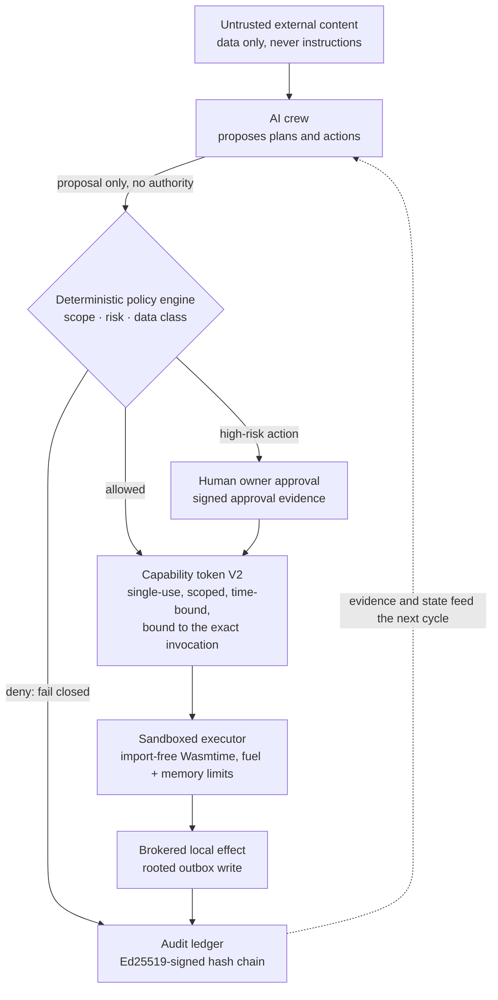
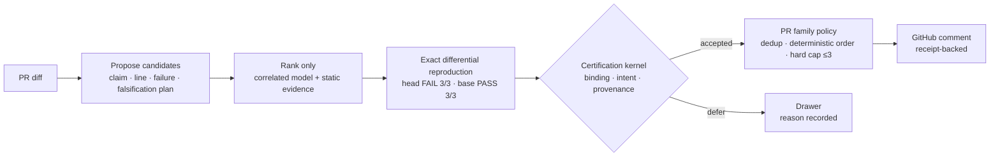

# Franz Xu

> **I build AI-native systems where the model proposes and a non-model kernel
> decides — so that capability grows without authority quietly following it.**

I am a developer and researcher working on secure agent infrastructure,
local-first systems, and reliable multi-agent decisions. Most AI products
optimize for producing an answer. I care about the step before that: **what an
agent is actually allowed to do, whose evidence counts, and whether the
evidence is strong enough to act.**

`Rust` · `Python` · agent runtimes · applied cryptography · AI evaluation

## Flagship — [Sovereign Founder OS](https://github.com/IcantFind-a-username/Sovereign-Founder-OS)

**A local-first operating system for running a one-person company with AI
agents — without surrendering data, decisions, or authority to any model or
provider.** This is my long-term work.

It now installs and runs as a macOS desktop app. The company it operates is not
chat history: it is a structured enterprise graph of customers, projects,
documents, invoices, and decisions, and every important effect on that graph
leaves signed, tamper-evident evidence.

| Today — the business state and what only the owner may decide | Privacy — exactly which bytes would leave this machine |
| --- | --- |
|  |  |

### What a founder can actually do today

- **Run the day.** Business tiles, the AI crew's pending proposals rendered as
  *the exact change approval would apply*, deterministic guidance, and the
  kernel evidence behind each one.
- **Hire an AI employee in one click.** Six bounded roles — requirements
  analyst, proposal writer, delivery planner, invoice clerk, quality checker,
  compliance checker — each carrying a card that states what it reads, what it
  delivers, and **what it may never decide**. A local model (Ollama, loopback
  only) produces the proposal when its output validates; otherwise a
  deterministic template does, and the decision record says which.
- **Keep the books and the paperwork.** Leads and customers with stage and
  consent, projects with dated tasks, drafts with revisions, signed send
  approvals, local RFC 5322 composition, revocation, and receivables with
  recorded payments.
- **Check obligations against recorded facts.** A Singapore rule pack where
  every rule cites its official source and findings are *pass / action /
  review / unknown* — never "compliant". It is an unreviewed demo pack and a
  reference for escalation, not legal advice.
- **See the boundary before crossing it.** For any task, an exposure preview
  compiles the outgoing projection and shows the per-field disposition, the
  exact text with the customer reduced to `[ORG_1]`, and its SHA-256 — before
  anything could be sent.

### The kernel underneath

Authority never originates in the model. It comes from deterministic policy and
explicit owner approval, arrives as a single-use token bound to one invocation,
spends itself in a sandbox that cannot import a host interface, and lands in an
append-only hash chain that can be verified offline. Sixteen Rust crates,
494 tests across 60 binaries, plus a cross-crate adversarial suite that attacks
the invariants rather than the features.

### Where it stands — and where it does not

Sovereign Founder OS is a **Developer Preview**. The primitives are real; the
product boundary is not yet a production security boundary, and the repository
says so line by line rather than rounding up:

- the loopback server rejects foreign `Host` headers and non-JSON mutations,
  but **there is no authenticated owner session** — a local caller can read
  decrypted workspace data through the API;
- the vault encrypts entries, but its master key sits beside the data;
- the desktop bundle is ad-hoc signed, not notarized — it is packaging around
  the audited binary, not a new trust boundary;
- AI employees are bounded proposers: no tools, no autonomy, no network send.

The long-term benchmark is deliberately hard, and openly labelled a research
target: *kill the model, the server, and the plugin — the company keeps
running.*

[Repository](https://github.com/IcantFind-a-username/Sovereign-Founder-OS) ·
[Manifesto](https://github.com/IcantFind-a-username/Sovereign-Founder-OS/blob/main/MANIFESTO.md) ·
[Architecture](https://github.com/IcantFind-a-username/Sovereign-Founder-OS/blob/main/ARCHITECTURE.md) ·
[Threat model](https://github.com/IcantFind-a-username/Sovereign-Founder-OS/blob/main/THREAT_MODEL.md) ·
[Roadmap](https://github.com/IcantFind-a-username/Sovereign-Founder-OS/blob/main/ROADMAP.md)

## Shipping — [Attest](https://github.com/IcantFind-a-username/Attest)

**Evidence-first AI code review: the model investigates, and a non-model
certification kernel decides what may be said.** The same separation as
Sovereign Founder OS, applied to a narrower problem — and packaged as a GitHub
Action.

Model agreement is treated as correlated ranking information, never as a vote
or a proof. A generated test runs repeatedly against the immutable head and the
merge base inside a secretless container; only the kernel can turn that
observation into an author-visible finding. Every red finding maps one-to-one
to a receipt binding the claim, hunk, exact test bytes, commands, interpreter,
environment, and controller seal — verifiable offline. A PR-level policy caps
the whole review at three findings.

- **The safety spine is on `main`** and has crossed the repository boundary: the
  Action installed on an outside repo, built its container on a hosted runner,
  ran a reproduction, and posted a real comment — a documented `DEFER`, not a
  claimed defect.
- **No borrowed certainty.** Across 100 recent change units the red path
  produced 21 accepted receipts and seven shadow findings; none published, none
  counted correct without independent adjudication.
- **The release gate is still red.** The preregistered null study stopped on a
  wrong publication twice; the open problem is distinguishing a regression from
  a deliberate value change. Private pilot, not a production service.
- **Failures are first-class output.** Budget exhaustion, unsupported
  execution, or inconclusive evidence become a named `DEFER`. Silence is an
  abstention, never a true negative.

[Repository](https://github.com/IcantFind-a-username/Attest) ·
[Architecture](https://github.com/IcantFind-a-username/Attest/blob/main/docs/architecture/target-algorithm.md) ·
[Design decisions](https://github.com/IcantFind-a-username/Attest/blob/main/DECISIONS.md)

## Research origin — [Corum](https://github.com/IcantFind-a-username/Corum)

Attest's statistical core was forged in Corum, a preregistered study of
dependence-aware consensus among imperfect AI reviewers. Its fail-closed
experiment returned an **honest negative result**: with a few near-independent
reviewers, no aggregation formula meaningfully beats reliability-weighted
voting. What survived the audit — calibrated posteriors that stay honest under
correlated evidence, and a redundancy discount that refuses to double-count
near-clone reviewers — became Attest. That discount was then priced, shipped,
and measured in production, where it has never changed an outcome; I report it
anyway. Corum falsified consensus *as evidence*; agreement is not confirmation,
disagreement is information. It stays frozen as the research record:
preregistration, locked judge, append-only ledgers, bit-reproducible results.

[Repository](https://github.com/IcantFind-a-username/Corum) ·
[Citation](https://github.com/IcantFind-a-username/Corum/blob/main/CITATION.cff)

## The through-line

Three projects, one question approached from three boundaries:

| Project | Question | Boundary |
| --- | --- | --- |
| **[Sovereign Founder OS](https://github.com/IcantFind-a-username/Sovereign-Founder-OS)** | What is an agent actually allowed to do? | Authority and execution |
| **[Attest](https://github.com/IcantFind-a-username/Attest)** | Is the evidence strong enough to speak? | Epistemic reliability |
| **[US Stock Helper](https://github.com/IcantFind-a-username/us-stock-helper)** | How can an AI assist without taking control? | Read-only decision support |

[US Stock Helper](https://github.com/IcantFind-a-username/us-stock-helper) is an
in-development, read-only research copilot for U.S. equities: it analyzes
completed bars for TD Setup, candlestick patterns, and order-flow participation
proxies. No package contains a broker, trade context, or order-submission
interface — it analyzes, never places orders.

## Background

At the University of Twente, I moved from Technical Computer Science into
Business Information Technology to work where software engineering, business
systems, and product meet. After a bachelor's thesis on machine-learning
predictive modelling, I am now pursuing an MSc in Blockchain Technology at
Nanyang Technological University, Singapore.

My recent industry work includes designing and primarily implementing the
upstream Requirement Agent for ICBC's in-house QUEST platform (2026), alongside
work on multi-agent consensus evaluation. Earlier projects lived primarily on
GitLab.

## Connect

I am actively looking for full-time roles in AI systems, security, or
infrastructure. I am also open to research conversations and collaboration on
secure agent runtimes or reliable multi-agent systems.

[LinkedIn](https://www.linkedin.com/in/yiqun-xu-8627a8264) ·
[Email](mailto:franzxu28@gmail.com) ·
[Sovereign Founder OS issues](https://github.com/IcantFind-a-username/Sovereign-Founder-OS/issues)
