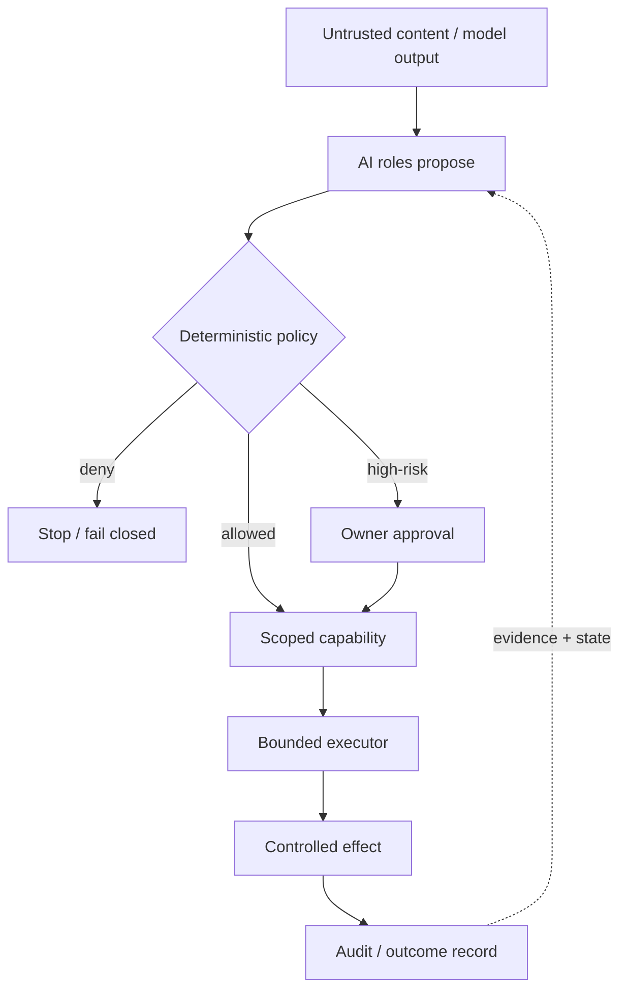

# Franz Xu

[](https://ghcommits.com/u/IcantFind-a-username)

> **I build AI-native systems where probabilistic models meet deterministic software boundaries.**

MSc Blockchain Technology @ Nanyang Technological University, Singapore · graduating **Jan 2027**  
BSc Business Information Technology @ University of Twente, Netherlands

`AI systems` · `agent infrastructure` · `Rust` · `Python` · `blockchain` · `applied cryptography` · `systems engineering`

## What I am working on now

My main direction remains **AI systems / agent engineering**: building software around agents that has explicit execution boundaries, evidence, failure semantics, and deterministic checks where they matter.

I am also actively shipping consumer products. **Miao Care (喵护)**, a cat-care companion I developed, is now live on iOS. I am currently pushing **OneTapVocal** toward release — an intelligent singing-video tuning product designed to make vocal correction and enhancement accessible from a mobile workflow, with an iOS App Store launch planned next.

At the same time, I am deepening the other half of my background — **hands-on blockchain engineering**. My current private engineering track is a DeFi liquidation/search system: historical on-chain replay, mainnet-fork simulation, liquidation economics, and eventually live shadow execution. The goal is not a career pivot away from AI; it is to add real EVM / DeFi / on-chain systems experience to a foundation that already includes L1/L2, scalability, privacy, and cryptography coursework.

I am deliberately keeping the current blockchain execution/search strategy private while it is being developed.

---

## Shipping & building

### Miao Care (喵护) — shipped on iOS

A cat-care companion focused on making day-to-day care easier to track and understand. I developed the product from concept through implementation and iOS release.

**Status:** live on the iOS App Store.

### OneTapVocal — building toward iOS release

An intelligent singing-video vocal tuning product. The product is under active development, with the current focus on turning the audio-processing workflow into a simple mobile experience rather than exposing the complexity of the underlying pipeline.

**Status:** active development · iOS App Store release planned next.

These product projects are intentionally different from my research-heavy systems work: they keep me close to **shipping, product judgment, mobile UX, iteration speed, and real users**.

---

## Selected systems & research work

### [Sovereign Founder OS](https://github.com/IcantFind-a-username/Sovereign-Founder-OS) — systems / Rust / agent execution

[](https://github.com/IcantFind-a-username/Sovereign-Founder-OS)
[](https://github.com/IcantFind-a-username/Sovereign-Founder-OS/blob/main/LICENSE)
[](https://github.com/IcantFind-a-username/Sovereign-Founder-OS)

A local-first founder workspace and systems experiment around **least privilege, explicit authority, controlled effects, provenance, and auditable execution**.

The codebase grew into an 18-crate Rust workspace with 571 Rust tests and several security-oriented primitives: scoped capabilities, deterministic policy gates, execution journals, bounded Wasm execution, local structured company state, and a hash-chained audit trail.

The current product path remains a **research/developer prototype**. Active feature development is paused while I focus my limited development time on other products and hands-on engineering work, but the codebase remains one of my main systems projects and a record of the design questions it exposed.

### Kernel path



The intended separation is simple: model output may propose an action, but authority is introduced separately through deterministic policy and, where required, explicit approval. The capability constrains the authorized invocation; the executor constrains where the effect happens; the outcome is recorded rather than silently becoming part of chat history.

The important result is not a claim that SFOS is a finished production security boundary. It is the engineering work and the limits it exposed.

What I took from it:

- intelligence and authority should not be treated as the same thing;
- security claims need explicit threat models and honest limitations;
- crash / ambiguous-effect states deserve first-class semantics rather than fake success;
- a smaller, understandable trusted boundary is usually more valuable than a feature-rich one.

[Repository](https://github.com/IcantFind-a-username/Sovereign-Founder-OS) · [Architecture](https://github.com/IcantFind-a-username/Sovereign-Founder-OS/blob/main/ARCHITECTURE.md) · [Threat model](https://github.com/IcantFind-a-username/Sovereign-Founder-OS/blob/main/THREAT_MODEL.md) · [RFCs](https://github.com/IcantFind-a-username/Sovereign-Founder-OS/tree/main/rfcs)

---

### [Attest](https://github.com/IcantFind-a-username/Attest) — AI evaluation / evidence-backed review

[](https://github.com/IcantFind-a-username/Attest/releases/latest)
[](https://github.com/marketplace/actions/attest-pull-request-review)
[](https://github.com/IcantFind-a-username/Attest/blob/main/pyproject.toml)
[](https://github.com/IcantFind-a-username/Attest)

**Evidence-first AI code review: the model investigates; a non-model certification kernel decides what is strong enough to publish.**

Attest reached an experimental public milestone as a GitHub Action. Generated tests run against the PR head and merge base inside a secretless container; accepted defect claims are backed by reproducible receipts rather than model confidence alone.

On a manually adjudicated sample of 44 merged pull requests across 13 open-source Python libraries, Attest published 7 lines: **4 useful, 3 true but not actionable, 0 judged wrong**. Recall was intentionally low and measured separately rather than hidden behind an accuracy headline.

**Active development is currently paused.** The latest public release remains `v0.2.0`, but I am intentionally not treating that version as the end-state of the idea. I paused expansion because my individual development bandwidth is currently going into other engineering and product work, not because the project has been reclassified as finished or abandoned.

Attest remains a concrete experiment in **abstention, falsification, deterministic gates, evidence provenance, and the separation between model judgment and publishable claims**.

[Marketplace](https://github.com/marketplace/actions/attest-pull-request-review) · [Repository](https://github.com/IcantFind-a-username/Attest) · [Receipts](https://github.com/IcantFind-a-username/Attest/blob/main/docs/receipts.md) · [Design decisions](https://github.com/IcantFind-a-username/Attest/blob/main/DECISIONS.md)

---

### [Corum](https://github.com/IcantFind-a-username/Corum) — research / multi-model verification

[](https://github.com/IcantFind-a-username/Corum)

Corum was a preregistered study of dependence-aware consensus among imperfect AI reviewers. The useful outcome was partly negative: **agreement between models is not automatically independent evidence**, and more aggregation machinery does not magically create a trustworthy confidence guarantee.

That result pushed my later work toward harder separation between probabilistic judgment and deterministic publication / execution rules.

[Repository](https://github.com/IcantFind-a-username/Corum) · [Citation](https://github.com/IcantFind-a-username/Corum/blob/main/CITATION.cff)

---

## Current engineering track — on-chain systems

I am currently using my blockchain background to build deeper **real-chain engineering experience**, not to replace my AI systems direction.

The current private project starts deliberately small:

```text
historical Morpho liquidation
        ↓
reconstruct pre-liquidation state
        ↓
liquidation / oracle / PnL math
        ↓
Foundry + mainnet-fork reproduction
        ↓
live shadow searcher
        ↓
only then consider real execution
```

This work is intended to exercise the full path from protocol mechanics to RPC/state reconstruction, Solidity/Foundry, transaction simulation, DeFi economics, DEX execution, gas/MEV constraints, and on-chain debugging.

My academic blockchain foundation includes **L1/L2 design, consensus/BFT, scalability, rollups, data availability, privacy, smart contracts, and cryptography**. The current goal is to connect that theory to a system that actually observes and interacts with live chain state.

---

## The through-line

These projects are different, but they share a systems mindset:

> **Build quickly, but make authority, evidence, assumptions, and failure modes explicit enough to reason about.**

| Area | What I have been exploring |
| --- | --- |
| **AI systems** | agents, execution boundaries, reliability, evaluation, human escalation |
| **Systems engineering** | Rust, explicit state machines, least privilege, provenance, failure semantics |
| **Blockchain** | L1/L2 foundations, cryptography, smart contracts, DeFi/on-chain execution |
| **Product engineering** | shipping mobile products, UX, iteration, turning complex pipelines into usable software |
| **Research engineering** | negative results, adversarial testing, reproducibility, calibrated claims |

I use modern AI coding tools aggressively to increase implementation speed, while treating architecture, assumptions, tests, and system understanding as the parts I still need to own.

---

## Background

At the **University of Twente**, I studied Business Information Technology after earlier Technical Computer Science coursework, combining software engineering with systems, data, and product-oriented project work.

I am now pursuing an **MSc in Blockchain Technology at Nanyang Technological University**. My coursework has covered blockchain privacy and scalability, L1/L2 mechanisms, cryptography, smart contracts, and related distributed-systems foundations.

Recent industry work includes designing and primarily implementing the upstream **Requirement Agent for ICBC's in-house QUEST platform**, together with work on multi-model evaluation and reliable AI-agent workflows.

---

## Roles I am interested in

For 2027 graduate / early-career roles, my primary interests remain:

- **AI Systems / Agent Engineer**
- **Applied AI / AI Infrastructure Engineer**
- **Systems / Reliability / Developer Infrastructure**

My blockchain background also gives me a second strong direction in:

- **Blockchain / DeFi Engineering**
- **Protocol / Digital-Asset Infrastructure**
- **Blockchain Security / on-chain systems**

I am most interested in roles where I can combine **AI-assisted engineering speed with systems-level reasoning**, rather than treating either AI or blockchain as a thin API layer.

## Connect

[LinkedIn](https://www.linkedin.com/in/yiqun-xu-8627a8264) · [Email](mailto:franzxu28@gmail.com)
