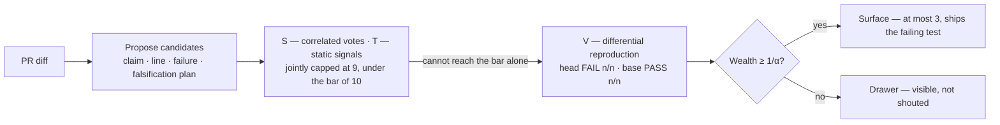

# Franz Xu

> **I build AI systems that know what they can trust — and when they should defer.**

I am a developer and researcher working on reliable multi-agent decisions,
secure agent infrastructure, and local-first systems. Most AI products optimize
for producing an answer. I care about the step before that: **whose evidence
counts, how much it counts, and whether the evidence is strong enough to act.**

`Python` · `Rust` · AI evaluation · distributed systems · applied cryptography

## Featured project — [Attest](https://github.com/IcantFind-a-username/Attest)

**Evidence-first AI code review — at most 3 inline comments per PR, each
backed by a differential run that failed on the head and passed on the base.
Silence over false positives.**

Attest reviews a diff the way a careful skeptic would: it treats every
candidate finding as a wager, buys evidence in a fixed order — proposer votes,
then static signals, then differential reproduction — and speaks only when the
purchased evidence clears a fixed odds threshold. Agreement is never a quorum,
there are no self-reported confidence scores, and nothing said is cheaper than
something wrong. Value-ordered scheduling is designed but not wired into the
product path; the shipped order is fixed.

The wealth process is a product of conservative likelihood ratios. It is
deliberately **not** an e-process, and the repository has said so since D-026.
Measurement later went further than the caveat: across every reachable channel
combination, multiplying the purchased channels has **never** changed a decision
that its strongest single channel had not already made. Differential
reproduction is what earns the right to speak; the rest is honest bookkeeping.

The gate has a third outcome, a silent discard at `wealth ≤ α`. At the factory
tables it is unreachable: the smallest wealth any candidate can hold is 0.5,
against a discard threshold of 0.1. The diagram shows the two branches that
actually occur.

### What makes it different

- **Silence over false positives.** Findings surface only when wealth crosses
  `1/α`; everything else stays in a visible drawer. Deferral is a valid result.
- **The pricing layer reports whether it is load-bearing.** Every candidate
  records whether the multiplication decided anything its strongest single
  channel had not. To date: **zero**, across all 45 reachable combinations and
  every candidate on record — because `S×T` caps at 9 against a threshold of 10.
  A mechanism that decides nothing should say so on the front page.
- **Evidence you can check.** Every finding carries a claim, an exact line, a
  failure scenario, a falsification plan, and the evidence actually purchased
  with its likelihood ratios. The generated test and both sides of the
  differential run are recorded in the ledger; posting the test alongside the
  comment is not yet implemented.
- **Correlated votes don't multiply.** Repeated samples from one model are a
  correlated panel, not independent witnesses — confidence stays honest under
  shared blind spots.
- **A hard budget, on the invoice.** Spend is pre-charged against a per-PR cap;
  over budget means an explicit DEFER with a reason, never a silent overrun.
- **BYOK, no server.** Your API key, your CI, your data. Nothing leaves.

[Repository](https://github.com/IcantFind-a-username/Attest) ·
[Design decisions](https://github.com/IcantFind-a-username/Attest/blob/main/DECISIONS.md)

## Research origin — [Corum](https://github.com/IcantFind-a-username/Corum)

Attest's statistical core was forged in Corum, a preregistered research project
on dependence-aware consensus among imperfect AI reviewers. Its formal,
fail-closed experiment returned an **honest negative result**: with a few
near-independent reviewers, no aggregation formula meaningfully beats simple
reliability-weighted voting. The audit of that failure identified what *did*
survive — calibrated posteriors that stay honest under correlated evidence, a
redundancy discount that refuses to double-count near-clone reviewers, and the
discipline of only adopting thresholds an oracle could actually pass. Those
survivors became Attest.

The follow-through is the part I would want a reader to check. One survivor —
the redundancy discount that keeps correlated reviewers from multiplying — was
carried into Attest, priced, shipped, and then measured. It has never changed an
outcome. Corum falsified consensus *as evidence*; that result stands, and it does
not extend to using several models as **distinct lenses**, where the value is
coverage of failure modes rather than accumulation of belief. Agreement is not
confirmation; disagreement is information.

Corum is kept frozen as the research record: preregistration, locked judge,
append-only ledgers, and bit-reproducible results.

[Repository](https://github.com/IcantFind-a-username/Corum) ·
[Citation](https://github.com/IcantFind-a-username/Corum/blob/main/CITATION.cff)

## The broader work

These projects approach trustworthy AI from three different boundaries:

| Project | Question | Boundary |
| --- | --- | --- |
| **[Attest](https://github.com/IcantFind-a-username/Attest)** | Is the evidence strong enough to speak? | Epistemic reliability |
| **[Sovereign Founder OS](https://github.com/IcantFind-a-username/Sovereign-Founder-OS)** | What is an agent actually allowed to do? | Authority and execution |
| **[US Stock Helper](https://github.com/IcantFind-a-username/us-stock-helper)** | How can an AI assist without taking control? | Read-only decision support |

### [Sovereign Founder OS](https://github.com/IcantFind-a-username/Sovereign-Founder-OS)

A local-first, open-source system for running a one-person company with AI
agents **without surrendering data, decisions, or authority** to a model or
provider. Its core rule is simple: what the model suggests and what the system
allows are separate.

The Developer Preview is a 16-member Rust workspace with deterministic policy,
single-use capability tokens, a Wasmtime sandbox, encrypted local state, and an
Ed25519-signed hash-chained audit ledger. The full end-to-end workflow remains
experimental, and the repository distinguishes implemented primitives from
planned hardening work.

The target authority loop keeps model output at proposal level. Deterministic
policy and explicit human approval grant narrowly scoped authority; sandboxed
execution and the signed audit ledger then make each important effect bounded
and traceable.

[Architecture](https://github.com/IcantFind-a-username/Sovereign-Founder-OS/blob/main/ARCHITECTURE.md) ·
[Threat model](https://github.com/IcantFind-a-username/Sovereign-Founder-OS/blob/main/THREAT_MODEL.md) ·
[Roadmap](https://github.com/IcantFind-a-username/Sovereign-Founder-OS/blob/main/ROADMAP.md)

### [US Stock Helper](https://github.com/IcantFind-a-username/us-stock-helper)

An in-development, read-only AI research copilot for U.S. equities. It analyzes
completed bars for TD Setup, candlestick patterns, and order-flow participation
proxies. No package contains a broker, trade context, or order-submission
interface: it analyzes, never places orders.

## Background

At the University of Twente, I moved from Technical Computer Science into
Business Information Technology to work where software engineering, business
systems, and product meet. After a bachelor's thesis on machine-learning
predictive modelling, I am now pursuing an MSc in Blockchain Technology at
Nanyang Technological University, Singapore.

My recent industry work includes designing and primarily implementing the
upstream Requirement Agent for ICBC's in-house QUEST platform (2026), alongside
work on multi-agent consensus evaluation. Earlier projects lived primarily on
GitLab.

## Connect

I am actively looking for full-time roles in AI systems, security, or
infrastructure. I am also open to research conversations and collaboration on
reliable multi-agent systems or secure agent runtimes.

[LinkedIn](https://www.linkedin.com/in/yiqun-xu-8627a8264) ·
[Email](mailto:franzxu28@gmail.com) ·
[Attest issues](https://github.com/IcantFind-a-username/Attest/issues)

