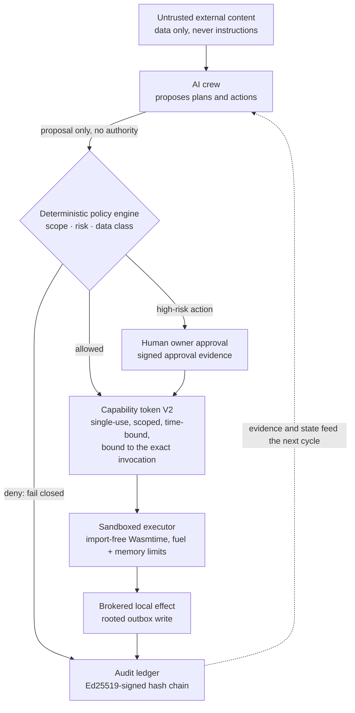

# Franz Xu

> **I build AI-native systems where the model proposes and a non-model kernel
> decides — so that capability grows without authority quietly following it.**

Most AI products optimize for producing an answer. I work on the step before
that: **what an agent is actually allowed to do, whose evidence counts, and
whether the evidence is strong enough to act.**

`Rust` · `Python` · agent runtimes · applied cryptography · AI evaluation

## Flagship — [Sovereign Founder OS](https://github.com/IcantFind-a-username/Sovereign-Founder-OS)

**A local-first operating system for running a one-person company with AI
agents — without surrendering data, decisions, or authority to any model or
provider.** My long-term work: 18 Rust crates, over 500 passing tests, and a
macOS app you can install.

The company it runs is not chat history. It is a structured graph — customers,
projects, dated tasks, documents, invoices, receivables, decisions — and every
important effect on it passes a deterministic policy gate before it happens and
leaves a device-signed hash-chained record after it does.

| Today — the business state, and what only the owner may decide | Privacy — exactly which bytes would leave this machine |
| --- | --- |
|  |  |

### You hire the AI employees; you keep the authority

Six bounded roles — requirements analyst, proposal writer, delivery planner,
invoice clerk, quality checker, compliance checker — that draft your discovery
notes, proposals, project plans, invoices and compliance reports. What makes
them safe is not the prompt, it is the plumbing:

- **Least privilege by construction.** Each role's prompt is built from a typed
  `RoleInput` carrying only the facts that role may see; a role cannot widen its
  own view of the company.
- **They propose; they never act.** `run_employee` returns a `Decision` and
  mutates nothing — your approval is what applies the exact recorded change,
  and hiring, approving and rejecting each pass a policy gate first. Every role
  card names what it may never do: the invoice clerk *cannot issue, send, or
  collect anything*; the quality checker *cannot approve on your behalf*.
- **Honest provenance.** A local model (Ollama, loopback only) writes the draft
  when its output validates; otherwise a deterministic template does — and the
  record says which, and a refused answer says which kind of wrong it was.
- **Obligations, cited.** A 13-rule Singapore pack — GST, corporate tax, ACRA,
  PDPA, record keeping, cross-border customers — where every rule carries its
  issuing authority and the date its source was read, findings are *pass /
  action / review / unknown*, never "compliant", and a new jurisdiction is a
  new pack rather than a change to the checker.

### The kernel underneath

Authority never originates in the model. It comes from deterministic policy and
explicit owner approval, arrives as a single-use token bound to one invocation,
spends itself in a sandbox that cannot import a host interface, and lands in an
append-only chain a third party can verify offline. Before anything may reach a
public model, a versioned transform must name every field it discloses — a
field it does not name is omitted, **so growing the data model cannot silently
start disclosing** — and the owner sees the exact outgoing bytes and their hash
first.

A cross-crate adversarial suite attacks those invariants rather than the
features: prompt injection cannot authorize a high-risk action; protected data
cannot reach a cloud tool even with a self-issued token; capability scope,
expiry and replay are enforced; tampered evidence is rejected.

### Where it stands — and where it does not

A **Developer Preview**. The primitives are real; the product boundary is not
yet a production security boundary, and the repository is specific about the
gap rather than rounding up:

<!-- sfos-status:start -->
**Status** (auto-updated weekly): CI on `main`: passing · last commit: 2026-09-11 · 7 design RFCs · no tagged release · checked 2026-09-11
<!-- sfos-status:end -->

- **No authenticated owner session yet** — a local caller can read decrypted
  workspace data through the loopback API, and the vault's master key sits
  beside the data.
- **The audit chain is tamper-evident, not yet rollback-evident**: it proves
  each event links to its predecessor and was signed by the trusted device, but
  an older valid *prefix* still passes until RFC 0007's freshness anchor lands.
- **The owner-session work is fenced off the product path by the compiler** —
  behind a non-default feature, its outcome type named `FixtureBootstrap` and
  unconstructible elsewhere — because a same-account process can win an
  empty-registry enrolment, so the fixture proves reproduction, never owner
  admission.

The long-term benchmark is deliberately hard and openly labelled a research
target: *kill the model, the server, and the plugin — the company keeps
running.*

[Repository](https://github.com/IcantFind-a-username/Sovereign-Founder-OS) ·
[Manifesto](https://github.com/IcantFind-a-username/Sovereign-Founder-OS/blob/main/MANIFESTO.md) ·
[Architecture](https://github.com/IcantFind-a-username/Sovereign-Founder-OS/blob/main/ARCHITECTURE.md) ·
[Threat model](https://github.com/IcantFind-a-username/Sovereign-Founder-OS/blob/main/THREAT_MODEL.md) ·
[RFCs](https://github.com/IcantFind-a-username/Sovereign-Founder-OS/tree/main/rfcs)

## Shipping — [Attest](https://github.com/IcantFind-a-username/Attest)

**Evidence-first AI code review: the model investigates, a non-model kernel
decides what may be said.** The same separation as Sovereign Founder OS,
applied to a narrower problem and packaged as a GitHub Action.

Model agreement is ranking information, never a vote or a proof. A generated
test runs repeatedly against the immutable head and the merge base in a
secretless container, and only the kernel can turn that observation into an
author-visible finding — each one backed by a receipt binding the claim, hunk,
exact test bytes, commands and environment, verifiable offline. A PR-level
policy caps the whole review at three findings.

- It has **crossed the repository boundary**: installed on an outside repo,
  built its container on a hosted runner, reproduced, and posted a real comment
  — a documented `DEFER`, not a claimed defect.
- **No borrowed certainty.** Across 100 recent change units the red path
  produced 21 accepted receipts; none published, none counted correct without
  independent adjudication.
- **The release gate is still red.** The preregistered null study stopped on a
  wrong publication twice; distinguishing a regression from a deliberate value
  change is the open problem. Private pilot, not a production service.

[Repository](https://github.com/IcantFind-a-username/Attest) ·
[Architecture](https://github.com/IcantFind-a-username/Attest/blob/main/docs/architecture/target-algorithm.md) ·
[Design decisions](https://github.com/IcantFind-a-username/Attest/blob/main/DECISIONS.md)

## Research origin — [Corum](https://github.com/IcantFind-a-username/Corum)

Attest's statistical core was forged in Corum, a preregistered study of
dependence-aware consensus among imperfect AI reviewers. Its fail-closed
experiment returned an **honest negative result**: with a few near-independent
reviewers, no aggregation formula meaningfully beats reliability-weighted
voting. What survived — calibrated posteriors under correlated evidence, and a
redundancy discount that refuses to double-count near-clone reviewers — became
Attest, where that discount was priced, shipped, measured, and has never
changed an outcome. I report it anyway. Agreement is not confirmation;
disagreement is information. Corum stays frozen as the research record.

## The through-line

| Project | Question | Boundary |
| --- | --- | --- |
| **[Sovereign Founder OS](https://github.com/IcantFind-a-username/Sovereign-Founder-OS)** | What is an agent actually allowed to do? | Authority and execution |
| **[Attest](https://github.com/IcantFind-a-username/Attest)** | Is the evidence strong enough to speak? | Epistemic reliability |
| **[US Stock Helper](https://github.com/IcantFind-a-username/us-stock-helper)** | How can an AI assist without taking control? | Read-only decision support |

## Background

At the University of Twente I moved from Technical Computer Science into
Business Information Technology, to work where software engineering, business
systems, and product meet. After a bachelor's thesis on machine-learning
predictive modelling, I am now pursuing an MSc in Blockchain Technology at
Nanyang Technological University, Singapore. My recent industry work includes
designing and primarily implementing the upstream Requirement Agent for ICBC's
in-house QUEST platform (2026).

## Connect

I am looking for full-time roles in AI systems, security, or infrastructure,
and open to collaboration on secure agent runtimes or reliable multi-agent
systems.

[LinkedIn](https://www.linkedin.com/in/yiqun-xu-8627a8264) ·
[Email](mailto:franzxu28@gmail.com) ·
[Sovereign Founder OS issues](https://github.com/IcantFind-a-username/Sovereign-Founder-OS/issues)
